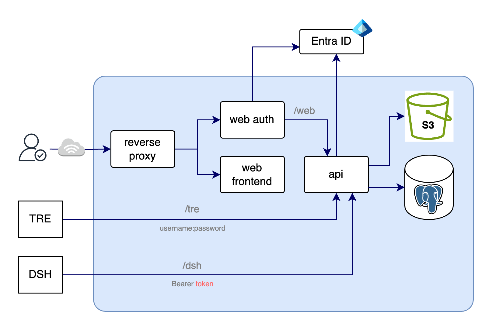
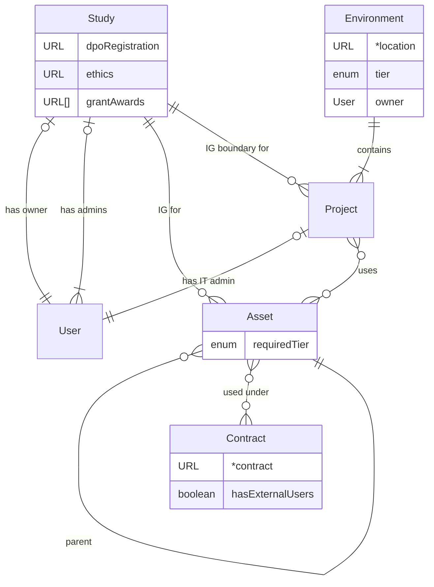

# Portal HLD

## As-is Portal(s)

Current portal is hosted in SharePoint, the data related to cases and (AKA studies and projects) researchers etc. in several SharePoint lists. Users logon to the sharepoint portal with their UCL username and password and are able to see and update their existing studies, make requests for new studies and complete other compliance processes such as user onboarding and registering data assets.

### Example forms and project list
[Register new case/study](https://liveuclac.sharepoint.com/sites/ISD.IGAdvisoryService/Lists/Start%20a%20service%20request/NewForm.aspx)

[View my projects](https://liveuclac.sharepoint.com/sites/ISD.IGAdvisoryService/Lists/Cases/Portal.aspx)

## To-be Portal

The replacement portal will manage [key ISMS processes](https://github.com/UCL-ARC/research-data-isms/tree/main/docs/Controlled_Processes). This portal will be use the pathfinder project for ARC's metadata store based on
[this design](https://github.com/UCL-ARC/metadata-store/blob/main/doc/specification.md).
Some processes such as incident and service request will be managed through "MyServices" (Xurrent) as per the pattern detailed [here in option 2](https://github.com/UCL-ARC/ARC-Strategy-and-Design/blob/main/Docs/Service_Design/ARC_Experience_and_Service_Platforms.md).

## Design Principles

Design will adhere to the [digital foundation principles](https://liveuclac.sharepoint.com/sites/it-architecture/SitePages/digital-foundation-principles.aspx).

Plus:

| Principle | Description | Implementation | Testing |
|------------|------------|----------------|----------|
|Reusable | The portal and underlying data structure will support a wide variety of use cases within ARC, initially focused on ARC services requiring similar functionality (EG. User onboarding) | Initially built around the TRE use case with input from the Research Computing and Research Data team to ensure designs support other use cases. | TBC
| Open Source | As much of the development should be made open source as possible with an output of the build being a design and code base. | TBC | TBC
| Master state data in the right pace | The state data of services and resources will remain mastered within platforms. This will include access control to resources and configuration of infrastructure. These state data will be read from the platforms (Such as TRE, RDP and Condenser) and processes managed within the portal may trigger changes in state within the platform. | TBC | TBC
| Retention of Quality Data | Where processes within the portal make changes to metadata or resources adequate quality data will be captured and retained in line with the requirements of any downstream system. | TBC | TBC

## Non-functional Requirements

### Data Classification

The portal and underlying data will be limited to storing confidential and public data.

### Availability

TBC

### Integrity

See above principle on quality data.

## Definition of the MVP

## Conceptual data model
This model represents an overview of the current understanding of the target main entities referenced in the project stories, with minimal detail. It improves in some respects from the model in the [as-is Portal](#as-is-portals).

Notes on syntax:
- [Crow's foot notation](https://en.wikipedia.org/wiki/Entity%E2%80%93relationship_model#Crow's_foot_notation)
- Some attributes use URLs to refer to entities in other systems. The local entity may express some inherited data about the referenced entity which is useful for local business rules, e.g. whether a Contract allows external users.

### Study
A **Study** is an abstract Information Governance boundary which is interpreted according to context. It may closely correspond to a real-world research study, a whole lab, or a research project or programme.

### Asset
An **Asset** belongs strictly to one **Study**. If the Study transfers an Asset to another Study, a new Asset is created. This should reference the original Asset through the `parent` relationship, so that provenance can be established. This relationship can carry additional information such as what derivation was used, e.g. anonymisation.

### Project
The **Project** entity type is expected to be subtyped for specific Environments, including with additional User roles (beyond the default `itAdmin`). E.g.
  - The ARC TRE Project subtype specifies desktop users, ingressers, etc.
  - The DSH Project subtype is called a "Share"
  - The Condenser Project subject is called a "Tenancy"

See also [Metadata Store conceptual model](https://github.com/UCL-ARC/metadata-store/blob/main/doc/specification.md#7-entity-relationship-er-logical-models)

## Application, database and integration design

The portal and database will use the Experience Layers [here](https://github.com/UCL-ARC/ARC-Strategy-and-Design/blob/main/Docs/Service_Design/ARC_Experience_and_Service_Platforms.md#4-experience-layers).

The portal will align to [this design](https://github.com/UCL-ARC/ARC-Strategy-and-Design/blob/main/Docs/Service_Design/ARC_Experience_and_Service_Platforms.md#62-option-2---portal-only-workflows-recommended-option) option to support researchers acknowledging that service request will still be submitted and managed in MyServices.

The overall design will be based on [The UCL Experience Framework](https://liveuclac.sharepoint.com/sites/it-architecture/SitePages/EF-architecture-patterns.aspx) (Pattern 4).
