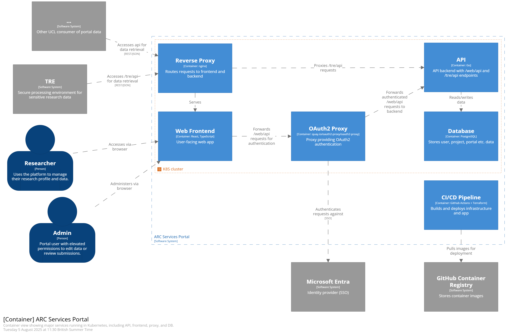

# ARC Services Portal HLD
## Introduction

The ARC services portal will support users creating and managing resources on ARC services such as TRE projects, RDSS shares, HPC access and Condenser projects. The initial use case laid out below is in support of the ARC TRE, Data Safe Haven and associated IG processes.

## The IG/TRE use case

In order to run the [Research Data ISMS](https://isms.arc.ucl.ac.uk/), ARC needs to ensure processes such as study creation and user onboarding are managed and collect quality data.

The replacement portal will manage [key ISMS processes](https://github.com/UCL-ARC/research-data-isms/tree/main/docs/Controlled_Processes). This portal will use the pathfinder project for ARC's metadata store based on
[this design](https://github.com/UCL-ARC/metadata-store/blob/main/doc/specification.md).
Some processes such as incident and service request will be managed through "MyServices" (Xurrent) as per the pattern detailed [here in option 2](https://github.com/UCL-ARC/ARC-Strategy-and-Design/blob/main/Docs/Service_Design/ARC_Experience_and_Service_Platforms.md).

##  As-is IG Portal(s)

Current portal is hosted in SharePoint, the data related to cases and (AKA studies and projects) researchers etc. in several SharePoint lists. Users logon to the sharepoint portal with their UCL username and password and are able to see and update their existing studies, make requests for new studies and complete other compliance processes such as user onboarding and registering data assets.

### Example forms and project list
[Register new case/study](https://liveuclac.sharepoint.com/sites/ISD.IGAdvisoryService/Lists/Start%20a%20service%20request/NewForm.aspx)

[View my projects](https://liveuclac.sharepoint.com/sites/ISD.IGAdvisoryService/Lists/Cases/Portal.aspx)

## To-be Portal

The portal is comprised of a NextJS frontend that uses a web api to interact with a backend database. Further APIs for supported platforms (initially the ARC TRE) connect the to the data to provide or configure access to resources. The app will access UCL enterprise systems using one of the [UCL producer patterns](https://liveuclac.sharepoint.com/sites/it-architecture/SitePages/integration-patterns.aspx). 

### Logical View

## Physical View

### Overview

The portal is deployed as a set of Kubernetes resources onto the ARC TRE's production/staging Amazon EKS clusters. An nginx reverse proxy receives all incoming http(s) requests, serving the web frontend at `/`, routing `/web/api` requests via an oauth2-proxy, and forwarding `/tre/api` requests.

As a target architecture, the diagram below shows how in the future, in addition to existing UCL TREs, other UCL systems and services will be able to access data in the portal database via api.

> [!NOTE]
> The `/tre/api` endpoint is not currently exposed externally because the portal and the ARC TRE run within the same Kubernetes cluster, allowing internal access. External access will be added in future updates to support integration with other consumers and TREs.

| Component           | Resource Type |
|---------------------|----------------|
| Web Frontend        | Deployment using custom image       |
| API                 | Deployment using custom image       |
| Nginx Reverse Proxy | Ingress using Nginx ingress cluster |
| OAuth Proxy         | Third party Helm Chart     |
| Postgres Database   | Third party Helm Chart     |

### Deployment Worflow

The diagram below shows the workflow that deploys the portal into the AWS VPC it currently resides in. The two sets of GitHub actions that run to deploy the app are grouped into the "Portal App Respository" and the "Infrastructure Respository". At present, the Portal App Repository is this GitHub repo. The Infrastructure Repository is the UCL ARC TRE's monorepo, a private repo which belongs to the [ucl-arc-tre GitHub organisation](https://github.com/ucl-arc-tre).

## Design Principles

Design will adhere to the [digital foundation principles](https://liveuclac.sharepoint.com/sites/it-architecture/SitePages/digital-foundation-principles.aspx).

Plus:

| Principle | Description | Implementation | Testing |
|------------|------------|----------------|----------|
|Reusable | The portal and underlying data structure will support a wide variety of use cases within ARC, initially focused on ARC services requiring similar functionality (EG. User onboarding) | Initially built around the TRE use case with input from the Research Computing and Research Data team to ensure designs support other use cases. | TBC
| Open Source | As much of the development should be made open source as possible with an output of the build being a design and code base. | TBC | TBC
| Master state data in the right pace | The state data of services and resources will remain mastered within platforms. This will include access control to resources and configuration of infrastructure. These state data will be read from the platforms (Such as TRE, RDP and Condenser) and processes managed within the portal may trigger changes in state within the platform. | TBC | TBC
| Retention of Quality Data | Where processes within the portal make changes to metadata or resources adequate quality data will be captured and retained in line with the requirements of any downstream system. | TBC | TBC

## Non-functional Requirements

### Data Classification

The portal and underlying data will be limited to storing confidential and public data.

### Availability

TBC

### Integrity

See above principle on quality data.

## Definition of the MVP

## Conceptual data model
This model represents an overview of the current understanding of the target main entities referenced in the project stories, with minimal detail. It improves in some respects from the model in the [as-is Portal](#as-is-portals).

Notes on syntax:
- [Crow's foot notation](https://en.wikipedia.org/wiki/Entity%E2%80%93relationship_model#Crow's_foot_notation)
- Some attributes use URLs to refer to entities in other systems. The local entity may express some inherited data about the referenced entity which is useful for local business rules, e.g. whether a Contract allows external users.

### Study
A **Study** is an abstract Information Governance boundary which is interpreted according to context. It may closely correspond to a real-world research study, a whole lab, or a research project or programme.

### Asset
An **Asset** belongs strictly to one **Study**. If the Study transfers an Asset to another Study, a new Asset is created. This should reference the original Asset through the `parent` relationship, so that provenance can be established. This relationship can carry additional information such as what derivation was used, e.g. anonymisation.

### Project
The **Project** entity type is expected to be subtyped for specific Environments, including with User roles. E.g.
  - The ARC TRE Project subtype specifies desktop users, ingressers, etc.
  - The DSH Project subtype is called a "Share"
  - The Condenser Project subject is called a "Tenancy"

See also [Metadata Store conceptual model](https://github.com/UCL-ARC/metadata-store/blob/main/doc/specification.md#7-entity-relationship-er-logical-models)

## Roles

The portal superimposes additional roles to the roles defined in the [Research Data ISMS](https://isms.arc.ucl.ac.uk/rism02-roles_and_responsibilities/). The following roles and their corresponding permissions may be assigned to qualifying authenticated users of the portal:

| Role               | Description                                                                 | Permissions                                                                 | Prerequisites                                      |
|--------------------|------------------------------------------------------------------------------|------------------------------------------------------------------------------|----------------------------------------------------|
| Base               | Standard user with limited access                                            | - Access to basic services                                                  | Exists in UCL Entra tenant                                   |
| Approved Researcher| User with Approved Researchers role. Allows them to access their Projects, or manage Study data if they are an IAO/IAA                              | - Access to specific Projects - Access to Study creation if eleigible                                               | Is an Approved Researcher                          |
| IG Admin           | Manage Information Governance via Study reviews and approvals, training certification reviews                 | - Write Study data - Write Study status                                  | Is an ARC Info Gov Advisory Team member            |
| TRE Ops staff         | TRE service member, view Project and role data                              | - Read Project and Role data - Write Project status                      | Is a UCL TRE service member                            |
| Global Admin       | Full control over portal                                                     | - Assign roles - Read/write everything                                   | Is an ARC Services Portal Admin                    |

> [!NOTE]
> Although "Approved Researcher" and "IAO"/"IAA" are different roles in the Researcch Data ISMS, there is no additional user role beyond "Approved Researcher" in the portal. The portal performs real-time checks to determine IAO/IAA eligibility, so there's no need for a separate role.

## Application, database and integration design

The portal and database will use the Experience Layers [here](https://github.com/UCL-ARC/ARC-Strategy-and-Design/blob/main/Docs/Service_Design/ARC_Experience_and_Service_Platforms.md#4-experience-layers).

The portal will align to [this design](https://github.com/UCL-ARC/ARC-Strategy-and-Design/blob/main/Docs/Service_Design/ARC_Experience_and_Service_Platforms.md#62-option-2---portal-only-workflows-recommended-option) option to support researchers acknowledging that service request will still be submitted and managed in MyServices.

The overall design will be based on [The UCL Experience Framework](https://liveuclac.sharepoint.com/sites/it-architecture/SitePages/EF-architecture-patterns.aspx) (Pattern 4).
