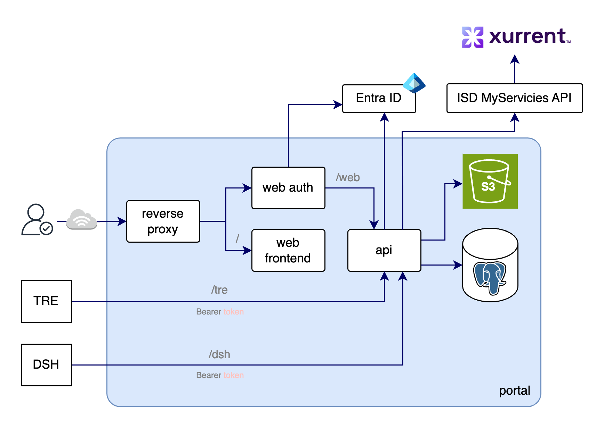

# UCL ARC Portal

This project is a full-stack web application built with:

- **Go** for backend services
- **React (NextJS)** for the frontend
- **Docker** for containerized development and deployment
- **Nginx** as a reverse proxy in dev
- **PostgreSQL** as the database
- **Cypress** for end-to-end (E2E) testing
- **S3** for object storage

---

## 📦 Project Structure

This project uses a [common Go project layout](https://github.com/golang-standards/project-layout) to structure both the backend Go backend API and React frontend as a monorepo.

```
.
├── cmd/                  # Entry points for Go binaries
│   ├── api/              # Main Go backend API server
│   └── web-frontend/     # Go server to serve compiled frontend in release
├── internal/             # Shared application logic (router, middleware, etc.)
├── web/                  # React frontend
├── deploy/               # Docker-related config
│   └── dev/              # Docker Compose and nginx config for dev
├── e2e/                  # Cypress E2E test setup and Compose config
├── Dockerfile            # Multi-stage Dockerfile that handles both dev and release builds
├── Makefile              # Dev and CI command shortcuts
```

---

## 🚀 Environments Overview

All environments are dockerised for a self-contained service that builds all versions of the application: dev, release, and e2e.

### 🧑‍💻 Local Development (`make dev`)

- Runs containers using `docker-compose` from [`deploy/dev/`](../deploy/dev/)
- React frontend is served by **NextJS dev server** with live reloading
- Go backend uses **Air** for live reloads
- Nginx acts as a reverse proxy ([nginx.conf](../deploy/dev/nginx.conf)):
  - `/` → React dev server
  - `/api` → Go backend API
  - `/oauth2` → OAuth2Proxy
- Accessible at: [http://localhost:8000](http://localhost:8000)
- S3 provided by [seaweedfs](https://github.com/seaweedfs/seaweedfs)

#### Helpful commands

- `make help`: Shows all the commands
- `make dev-psql`: Opens a psql interactive terminal into the dev postgres database
- `make dev-s3`: Runs a seaweedfs admin UI on http://localhost:23646 (username and password are `admin`)
- `make dev-destroy`: Downs the docker compose stack

### 🔐 Release

- This environment is used for the production release
- React frontend is built into static files (see [`Dockerfile`](../Dockerfile) in the `web-frontend-builder` section)
- Go backend and frontend servers are compiled into standalone binaries
- Static frontend is served by the `web-frontend` Go binary (see `cmd/web-frontend`)
- S3 is provided by AWS S3

### 🧪 Testing

#### Unit (`make test-unit`)

- Uses [go tests](https://go.dev/doc/tutorial/add-a-test) with [testify](https://github.com/stretchr/testify)

#### End-to-end (`make test-e2e-release`)

- Uses Docker Compose from [`e2e/`](../e2e/)
- Spins up release versions of frontend, backend, database, and nginx (see Release section above for details)
- Cypress runs tests against the full stack via nginx at `http://localhost:8000`

#### Manual

Some flows are not easily end-to-end testable so rely on manual tests

1. Approved researchers import: (a) Create a dev environment, (b) Login as a role with permission to import approved researchers, (c) Upload [approved-researchers-external.csv](../internal/service/users/testdata/approved-researchers-external.csv). An invite email should be appear in the dev email inbox (see slack docs for access)

---

## 🏛️ Architecture

<p align="center">
  
</p>

### API

The API is a monolith which is the sole interface to the database. Services have their own top-level
paths. The web API called by the web frontend is defined in [api/web.yaml](../api/web.yaml) and must
be run behind an authentication proxy which forwards user identities. The TRE API consumed by the
TRE is defined [api/tre.yaml](../api/tre.yaml) and uses basic authentication with service accounts. The DSH API consumed by the
Data Safe Haven is defined [api/dsh.yaml](../api/dsh.yaml) and uses JWT bearer token authentication. Tokens can be created in the UI by DSH operations staff.

### RBAC

Role base access control is implemented with [casbin](https://casbin.org/) using deploy-time
set global administrators, and runtime set roles and policies. See the [HLD](./High-Level_Design.md#roles) for a description of the roles.
